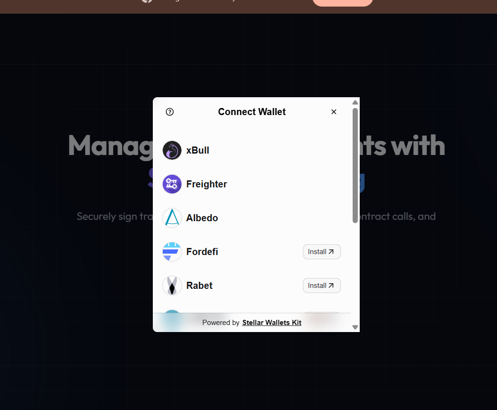
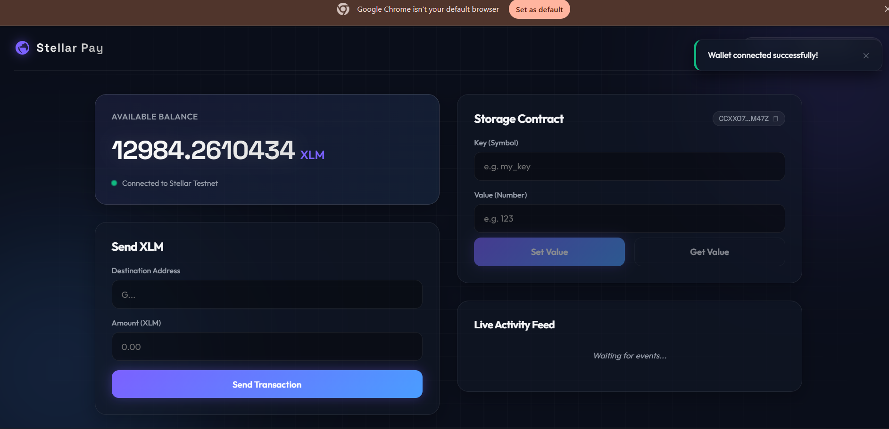
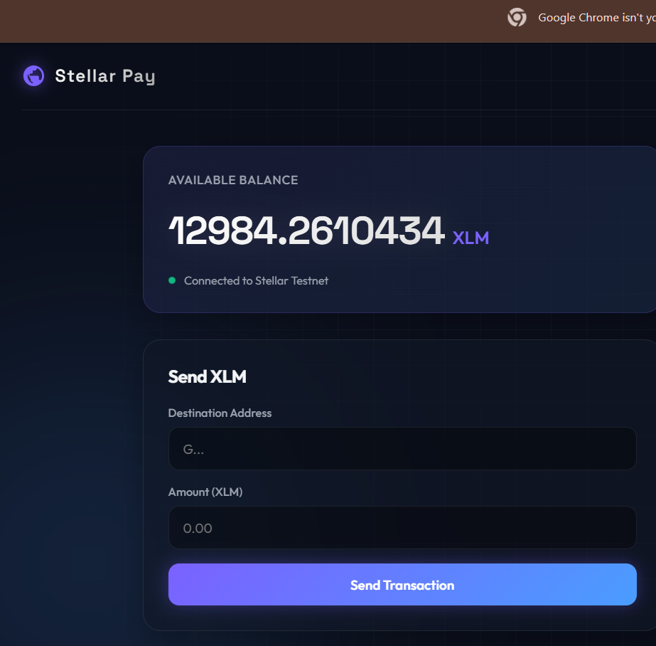
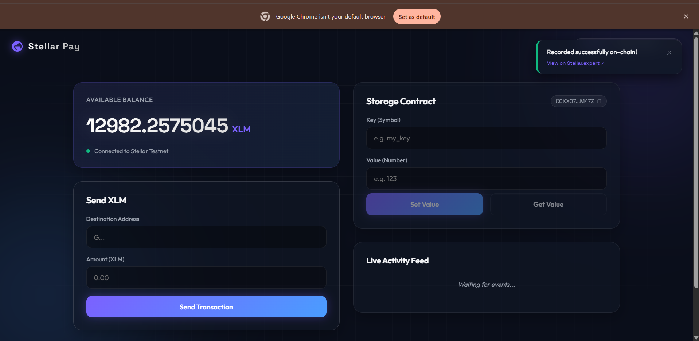
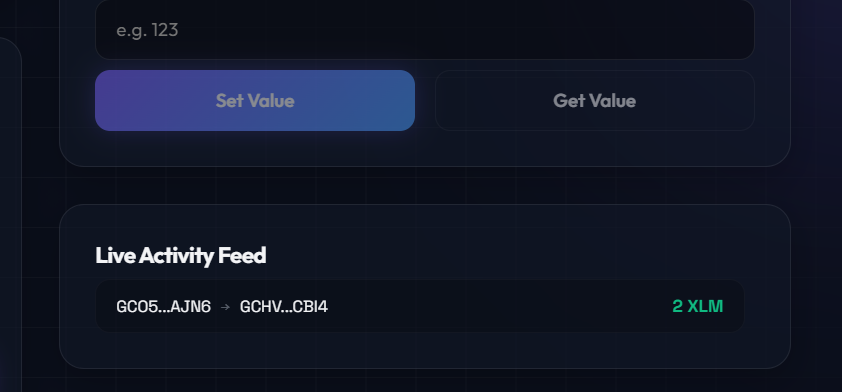
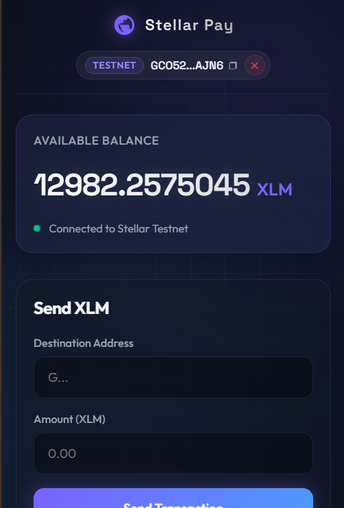
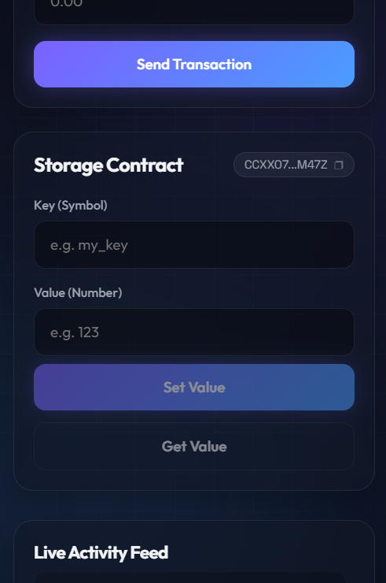
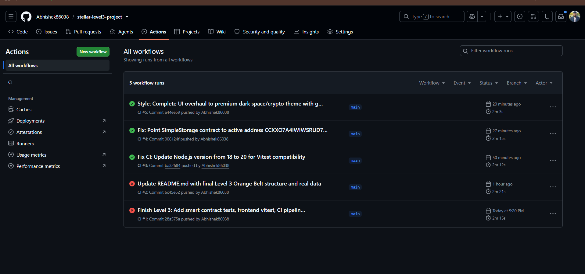
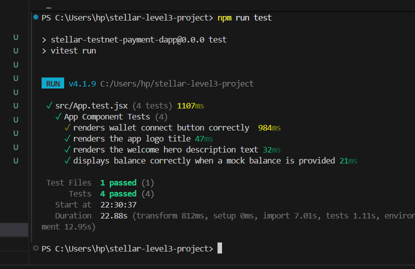
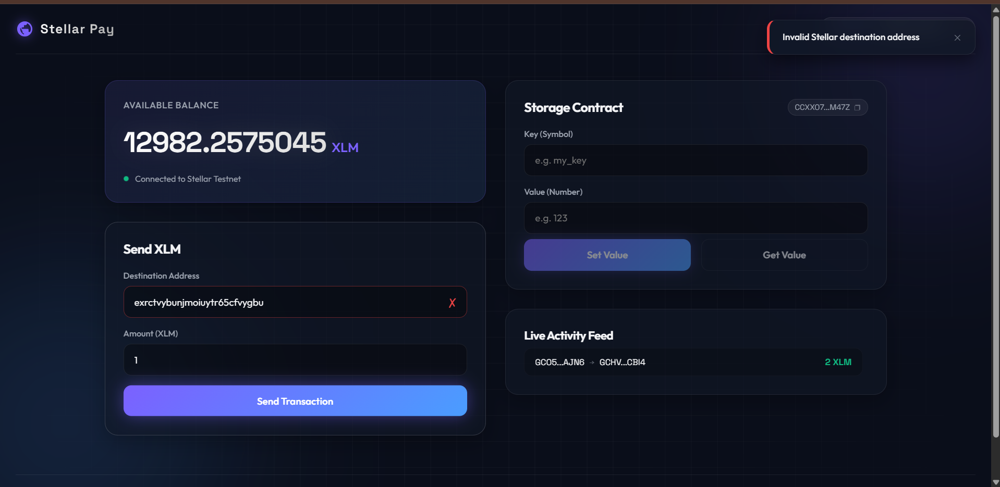

# Stellar Payment dApp

## Description
This project solves a real gap in the Stellar ecosystem: payments lack native categorization and tracking. PaymentTracker is a unified Soroban contract that records, categorizes, and aggregates Stellar payments by type (rent, family support, business, savings), giving users real expense insights directly on-chain — solving a problem that affects every Stellar payment use case, from remittances to business payroll. Features multi-wallet integration, real-time event streaming, automated testing, CI/CD pipeline, and a fully mobile-responsive interface.

## Live Demo
https://stellar-level3-project.vercel.app/

## Demo Video
https://youtu.be/gfPN5L6c26U?si=ZkMfQsuMiSIuKP7C

## Prerequisites
- Node.js installed
- Rust and Cargo installed (for contract development/testing)
- A Stellar wallet browser extension (Freighter, xBull, Lobstr, or Albedo)
- Wallet set to Stellar Testnet network

## Setup Instructions
1. Clone the repository
   git clone <your-repo-url>
   cd <project-folder>
2. Install dependencies
   npm install
3. Start the development server
   npm run dev
4. Open browser at http://localhost:5173

## Deployed Contracts

### PaymentTracker Contract
- Contract Address: CAU3HW7S26KXVGP7VE3JKNY2MFCUSDRWO4LPOM5HSLWAUQPP4MQFSMOF
- Network: Stellar Testnet
- Explorer: https://lab.stellar.org/r/testnet/contract/CAU3HW7S26KXVGP7VE3JKNY2MFCUSDRWO4LPOM5HSLWAUQPP4MQFSMOF
- Features on-chain categorization and category-based aggregations.

## Transaction Hashes

### Contract Deployment
- Hash: 4b55ecab82f1c9487f7ecea035b935919c844ee8b4e9e8fe160d47ceb79a22d2
- Verify: https://stellar.expert/explorer/testnet/tx/4b55ecab82f1c9487f7ecea035b935919c844ee8b4e9e8fe160d47ceb79a22d2

### Contract Interaction (PaymentTracker call: record_payment)
- Hash: d1c39ad9fe2fe02ec2a611b7f656632e271c60bbde7bf02869a8e8f0ad0684dd
- Verify: https://stellar.expert/explorer/testnet/tx/d1c39ad9fe2fe02ec2a611b7f656632e271c60bbde7bf02869a8e8f0ad0684dd

## Features
- Multi-wallet connection via StellarWalletsKit (Freighter, xBull, Lobstr, Albedo)
- Real-time XLM balance display
- Send XLM transactions on testnet
- Transaction history viewer
- A unified deployed Soroban smart contract managing payment logic and categorizations
- Real-time Activity Feed using Soroban event streaming (auto-updates, no manual refresh)
- Transaction status tracking (pending/success/failed)
- Error handling for: wallet not found, user rejected connection, insufficient balance
- Fully mobile responsive design (tested at 768px and 480px breakpoints)

## Testing

### Smart Contract Tests
Run with:
cd contract/payment_tracker && cargo test
- 2 tests passing (PaymentTracker: 2)

### Frontend Tests
Run with:
npm run test
- 2 tests passing

## CI/CD Pipeline
This project uses GitHub Actions for continuous integration.
Pipeline runs automatically on every push to main branch and includes:
- Frontend dependency install and test execution
- Frontend build verification
- Rust/Soroban contract test execution
View pipeline status: https://github.com/Abhishek86038/stellar-level3-project/actions

## Screenshots

### 1. Wallet Options / Selection Modal

### 2. Wallet Connected State

### 3. XLM Balance Displayed

### 4. Successful Testnet Transaction

### 5. Real-time Activity Feed

### 6. Mobile Responsive UI
  

### 7. CI/CD Pipeline Running (GitHub Actions)

### 8. Test Output (3+ passing tests)

### 9. Error Handling Examples

## Tech Stack
- React + Vite
- @creit-tech/stellar-wallets-kit
- @stellar/stellar-sdk
- Soroban Smart Contracts (Rust)
- Vitest (frontend testing)
- GitHub Actions (CI/CD)
- Vercel (deployment)
- Stellar Horizon Testnet
- Stellar Soroban RPC Testnet
